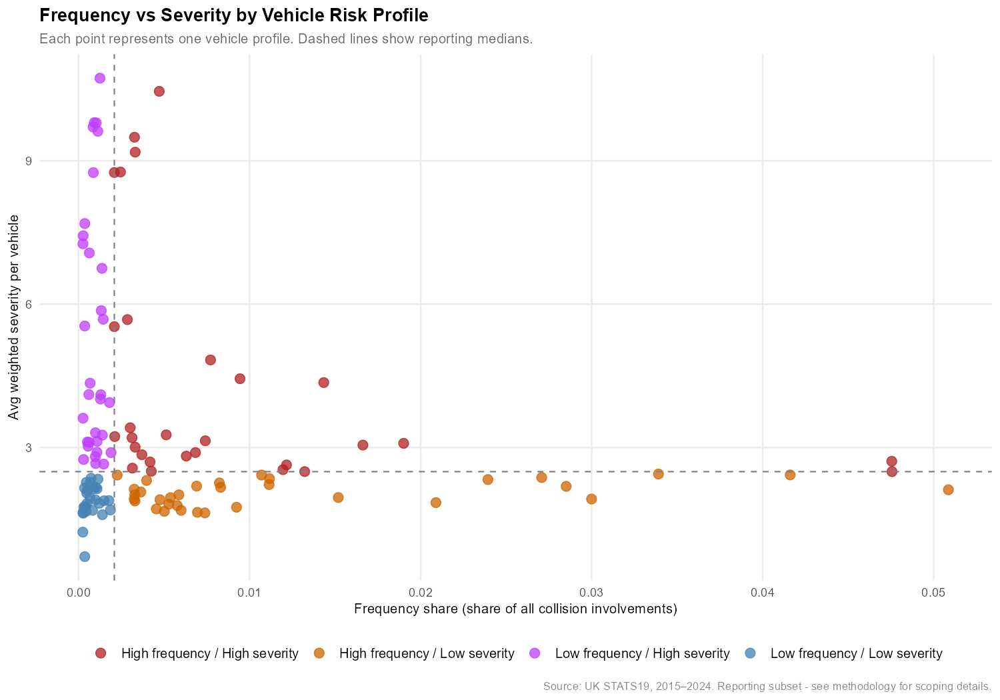
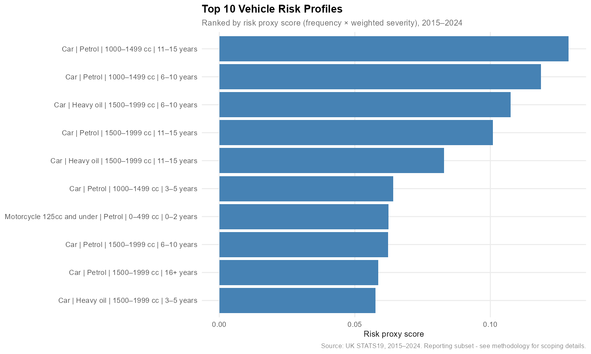
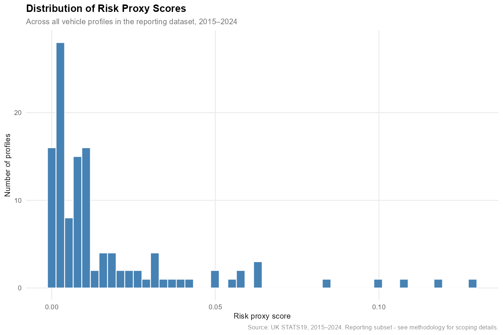
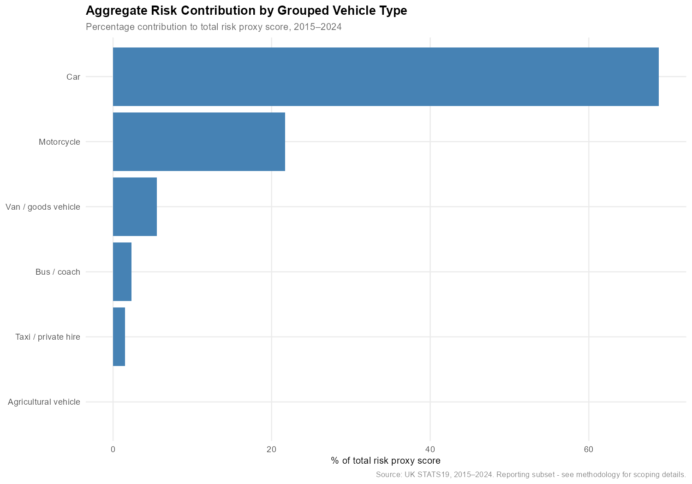
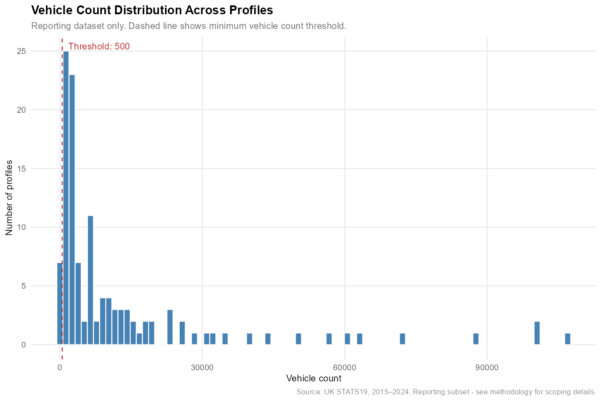
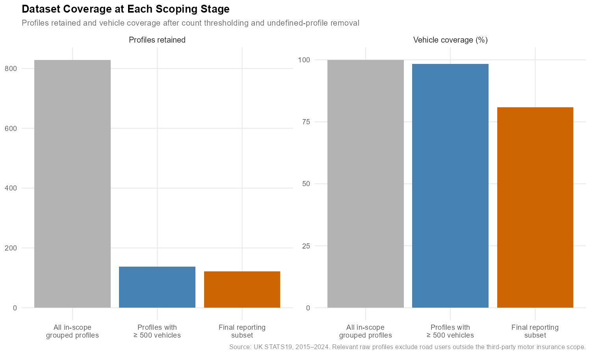

# Predicting Premium Risk: UK Road Safety Analytics

This project demonstrates an end-to-end data analytics pipeline using UK STATS19 road safety data. It investigates how, and to what extent, open collision, casualty, and vehicle records can be transformed into an insurer-relevant relative-risk profiling framework, using a heuristic frequency × severity proxy to support third-party motor insurance decision-making.

The result is an exploration of how publicly available UK road collision data can be used to generate business insights that strengthen data-driven decision-making in motor insurance risk. From sourcing and ingestion through to transformation, validation, exploratory analysis, analytical scoping, and visual communication, this project demonstrates a professional-grade application of data analytics to a commercially relevant risk problem.

**Defining heuristic and proxy:** 
In this project, **heuristic** refers to the simplified, rule-based methodology used to approximate risk where richer actuarial claims, exposure, and pricing data are unavailable. In practice, that includes assigning fixed weights to casualty severity levels as a reasonable stand-in for likely third-party payout severity, on the assumption that more severe injuries are generally associated with greater insurer liability. **Proxy** refers to the resulting frequency × severity measure, used as a practical stand-in for fuller actuarial assessment of relative third-party motor insurance risk.

### Business Task

How, and to what extent, can open UK road safety data be used to estimate the relative risk profile of different vehicle characteristics in order to support third-party motor insurance premium pricing decisions?

### Context and Scope

The analysis is explicitly framed around third-party motor insurance, which exists to provide financial cover for people injured as a result of an insured driver’s actions. Within that context, injury severity and collision frequency are treated as the key drivers of relative financial exposure, which is why their combination is used here as a proxy for third-party liability risk.

To maintain a clear purpose and disciplined scope, the project examines collisions only in relation to broad, vehicle-intrinsic characteristics: including vehicle type, engine capacity, propulsion type, and vehicle age. More granular factors, such as individual vehicle models or driver demographics, are deliberately excluded, as modelling these responsibly would require additional exposure, behavioural, and claims data beyond what STATS19 can provide.

### Not in Scope

- Exposure-adjusted rates (for example per vehicle-mile or per registered vehicle)
- Claim or collision probability modelling
- Claim cost estimation, reserving, or full premium modelling
- Causal inference across vehicle, driver, or environmental factors
- Driver behaviour, demographics, or fault attribution

### Project Structure

- **sql/**  
  SQL scripts for raw data ingestion, staging, mart construction, and core risk metric creation from STATS19 data.

- **r/**  
  R scripts for mart extraction, transfer validation, exploratory analysis, analytical scoping, visualisation, and interpretation.

- **data/**  
  - **raw/**: Renamed, but otherwise unmodified STATS19 CSV files (gitignored due to size).  
  - **sample/**: Small representative samples used for demonstration and reproducibility support.

- **outputs/**  
  Generated figures, tables, and other derived outputs produced during analysis (gitignored - final visuals or summaries are promoted to the README or docs when ready).

- **docs/**  
  Supporting documentation covering methodology, assumptions, and decision rationale.

### Data Architecture 

The project follows a layered relational structure:

1. **Raw** (`raw` schema)  
   Exact mirror of the official STATS19 CSV files. All columns are stored as TEXT. No filtering or transformation is applied.

2. **Staging** (`stg` schema)  
   Applies the analytical time window (2015–2024), performs explicit type casting, normalises missing values, and enforces relational grain via primary and foreign keys. No aggregation is introduced at this stage. A single source-level anomaly in casualty numbering is acknowledged and handled structurally without dropping records.

3. **Mart** (`mart` schema)  
   Constructs analysis-ready business-grain tables used to implement the frequency × severity risk proxy.

This layer:

- Aggregates casualty-level records to vehicle involvement level
- Applies heuristic weighting across slight, serious, and fatal casualty severity categories
- Reintroduces the full collision-involved vehicle universe
- Decodes categorical variables and bands continuous variables for stable grouping
- Aggregates to a final risk profile grain defined by:
  `(vehicle_type, propulsion_code, engine_capacity_band, vehicle_age_band)`

*All core frequency and severity metrics are calculated in SQL.*  
*R is used for independent validation, exploratory analysis, scoping, visualisation, and interpretation. It does not recalculate the core mart metrics.*

### Analytical Framework

This project uses a frequency × severity framework to compare the relative third-party injury risk associated with broad vehicle profiles. The logic is intentionally simple. If a vehicle profile appears more often in the collision dataset, it contributes more to the overall risk landscape. If collisions involving that profile also tend to produce more severe casualty outcomes, its relative risk increases further.

The framework therefore combines two distinct signals. The first is frequency, which captures how large a profile’s presence is within the collision-involved vehicle universe. The second is casualty severity, which captures the average injury burden associated with each collision-involved vehicle in that profile. Taken together, they provide a practical basis for relative comparison across vehicle profiles defined by broad, fixed vehicle characteristics.

A key advantage of this structure is that it preserves the distinction between different kinds of high-risk profile. Some profiles may rank highly because they appear frequently in the collision data. Others may appear less often, but generate materially worse injury outcomes when they do. Separating frequency from severity makes that difference visible, which allows for greater clarity in the insights this analysis.

### Risk Metric Construction

The frequency × severity framework is implemented in the mart layer through a set of deliberately ordered metric calculations.

A weighted severity measure is first constructed at the vehicle involvement level. Casualty records are aggregated to one row per `(collision_index, vehicle_reference)`, and injury severities are converted into a weighted index using fixed constants:

- slight = 1
- serious = 15
- fatal = 60

This produces a `weighted_severity_score` for each collision-involved vehicle.

Those vehicle-level rows are then aggregated to the project’s final business grain:

`(vehicle_type, propulsion_code, engine_capacity_band, vehicle_age_band)`

At that profile level, the mart produces the project’s core metrics:

- `weighted_severity_total`: the summed vehicle-level severity score across all vehicles in the profile
- `avg_weighted_severity_per_vehicle`: the average weighted severity burden per collision-involved vehicle in the profile
- `frequency_share`: the profile’s share of all collision-involved vehicles in the dataset
- `risk_proxy_score`: the combined frequency × severity signal used for relative comparison
- `risk_rank`: a descending dense rank over `risk_proxy_score`

This structure preserves a clear distinction between vehicle-level severity construction and profile-level risk comparison, while keeping the final mart output directly interpretable for downstream validation, analysis, and visualisation in R.

### Validation Approach

Before any exploratory analysis or visualisation takes place, the final mart output is validated in R to confirm that it remains structurally sound and mathematically consistent after SQL transformation and transfer into the R environment.

This validation step checks that the core metric relationships still hold after extraction from SQL, rather than assuming the mart output has transferred perfectly into R. In practice, that includes confirming:

- `risk_proxy_score` matches `frequency_share × avg_weighted_severity_per_vehicle`
- `avg_weighted_severity_per_vehicle` matches `weighted_severity_total / vehicle_count`
- the final business-grain rows remain unique
- key metric and dimension fields contain no unexpected missing values
- `frequency_share` sums to 1 across the full mart output
- `risk_rank` is populated consistently
- column types and overall dataset dimensions are as expected

Where calculated values are compared, checks are applied with a small floating point tolerance to account for minor machine-precision differences between SQL and R. This keeps the validation strict without treating negligible numerical noise as a data quality issue.

By separating metric construction in SQL from validation in R, the project introduces an independent cross-layer check before interpretation begins. That makes the downstream exploratory analysis, scoping decisions, and visual outputs easier to trust, because they are working from an output that has already been tested for internal consistency.

### Scoping Decisions

Exploratory analysis was first carried out on the full unscoped mart output before any analytical filtering was applied. This allowed profile stability, coverage, and interpretability to be assessed across the complete collision-involved vehicle universe.

The scoping rules introduced later in the pipeline were informed by those observations, chiefly to address very low-count profiles, out-of-scope vehicle types, and weakly defined groups that could not support meaningful reporting. To preserve the integrity of the core metrics, all scoping takes place after metric construction rather than before it.

### Visual Outputs

The final visualisation stage translates the scoped analytical output into a small set of README-facing figures designed to support interpretation rather than extend the modelling logic. The charts use consistent mappings between variables and visual encodings to support direct comparison across views.

These figures focus on the reporting subset and are used to show the project from several complementary angles:

- the relationship between frequency and severity across profiles
- ranked high-risk profiles
- the overall distribution of risk proxy scores
- aggregate risk contribution by grouped vehicle type
- the distribution of profile vehicle counts
- coverage retained across the full, scoped, and reporting datasets

Together, they provide a concise view of both the analytical results and the trade-offs introduced by scoping. Interpretive charts are built from the reporting subset, while the coverage summary shows how much of the full collision-involved vehicle universe remains represented after each scoping stage.

### Requirements

This project is carried out using PostgreSQL and R within a simple end-to-end analytics stack. It assumes basic command-line familiarity for raw data ingestion, as the PostgreSQL client (`psql`) is used to load local CSV files via client-side operations that sit outside the database server.

### Database

- **PostgreSQL** - *Relational database management system (DBMS)*
- **psql** - *PostgreSQL command-line client used for client-side raw CSV ingestion*

### R Environment 

- **R (v4.4.3+)** - *RStudio IDE is recommended, but optional*

**Required R Packages**

- tidyverse
- DBI
- RPostgres
- knitr
- rmarkdown

*If needed, the following command will install the packages above in your local environment:*

`install.packages(c("tidyverse", "DBI", "RPostgres", "knitr", "rmarkdown"))`

### Reproducing the Analysis

To reproduce the analysis locally, follow the steps below.

1. Download the UK STATS19 master CSV files (Collisions, Vehicles, Casualties) in full from the official GOV.UK source.  
   These files contain all available historical data (1979–present).

2. Rename the files to the following standardised names:
   - collisions_master.csv
   - vehicles_master.csv
   - casualties_master.csv

3. Place the raw CSV files in the local `data/raw/` directory.  
   This directory is intentionally gitignored and raw data files are never committed to the repository.

4. Run the SQL scripts in numeric order:
   - sql/00_setup/
   - sql/01_raw/
   - sql/02_stg/
   - sql/03_mart/

   *Raw ingestion scripts must be executed via `psql` in a shell. Staging, constraint, and mart scripts run server-side.*

5. Run the R scripts in the `r/` directory to generate validation checks, summary tables, and figures used in the analysis and documentation.

### Running SQL Raw Ingestion Scripts

Raw data ingestion scripts use the PostgreSQL `psql` command-line client and the client-side `\copy` command to ingest local CSV files. This is necessary because the database server cannot directly access the client’s local file system where the raw source CSV files reside. Using `psql` inside a shell application bridges this gap by streaming data *over* the connection, a capability that scripts executed wholly within the database server lack due to security and permission constraints.

Execute the raw ingestion scripts (02, 04 and 06) from a shell environment with the working directory set to the project root, so relative paths to files inside `sql/01_raw/` and `data/raw/` resolve correctly.

*Example command order:*

1. `cd Predicting-Premium-Risk` - *Sets the shell working directory to the root of the repository so relative file paths resolve correctly.*

2. `psql -d predicting_premium_risk -f sql/01_raw/02_ingest_raw_collisions.sql` - *Launches the PostgreSQL command-line client, connects to the `predicting_premium_risk` database, and executes the specified SQL script sequentially against that connection.*

## Report and Findings

The findings here pertain to the final reporting subset obtained through the prior ingestion, cleaning, validation, and scoping processes. They are designed to show how the STATS19-derived analytical framework can support relative comparison across better-represented and more interpretable vehicle-characteristic profiles.

### Finding 1: Relative-risk signals emerge in various ways across profiles

Figure 1 separates the two components that sit underneath the proxy by plotting `frequency_share` against `avg_weighted_severity_per_vehicle`. It provides the clearest visual test of whether open UK road safety data can be structured into a meaningful relative-risk view across grouped vehicle characteristics (profiles).

Several useful patterns are visible within this landscape. Many higher-frequency profiles sit within a relatively narrow, lower average severity band. When observed individually, these points almost all represent mainstream car segments, suggesting a broadly similar third-party severity burden among the most common collision-involved vehicle profiles. By contrast, profiles with the highest average severity tend to exhibit lower `frequency_share`, suggesting a different kind of signal within these profiles: less collision presence, but higher average injury burden when those profiles do appear in recorded collisions. When inspected individually, this higher-severity area is dominated by motorcycle profiles, which provides an important severity-led signal that would be less visible from the combined proxy ranking alone. The high-frequency / high-severity quadrant is comparatively sparse, but strategically important because it highlights profiles where both collision presence and injury burden are elevated under the proxy - these are the profiles that would warrant especially close pricing review. The low-frequency / low-severity quadrant is more densely populated and completes the proxy risk landscape, signalling profiles where both collision presence and average injury burden are lower within the reporting view.

For an insurer, this helps turn the dataset into an early map of potential portfolio risk. It suggests by each profile where risk may be more volume-led, where it may be more severity-led, and where both pressures appear together. This does not translate directly into claims cost, but under the project’s severity-as-cost proxy logic, it provides an initial view of how different vehicle profiles might express risk, and which areas may warrant closer analytical or pricing review.

Because only collision-involved vehicles enter STATS19, this should not be read as evidence of true exposure-adjusted risk across all vehicles on the road. It is, however, a useful map of the collision-involved landscape. Taken as a broad structural view, Figure 1 shows that the dataset does not produce one undifferentiated cluster of vehicle profiles; when observed through the proxy, profiles separate according to the interaction between collision presence and injury burden.

### Finding 2: Mainstream car segments dominate the top 10 risk profiles, though their risk score structure is not uniform

Figure 2 provides a ranked view of the upper end of `risk_proxy_score`. The top 10 is dominated by cars, especially petrol cars in the 1000–1499cc and 1500–1999cc bands, with 6–15 year vehicles appearing repeatedly. The highest-ranked profile is Car | Petrol | 1000–1499 cc | 11–15 years, followed by Car | Petrol | 1000–1499 cc | 6–10 years, and several other positions are also occupied by petrol and diesel cars in the 1500–1999cc range. One notable exception to the otherwise car-dominant pattern is Motorcycle 125cc and under | Petrol | 0–499 cc | 0–2 years, which ranks seventh.

Notably, when the top 10 profiles are linked back to the frequency / severity quadrants from Figure 1, they do not all fall into the same category. Eight of the ten sit in the high-frequency / high-severity quadrant, while two sit in the high-frequency / low-severity category. This adds useful context to the ranking: the upper end of the proxy is largely made up of profiles where both collision presence and injury burden are elevated relative to the reporting subset median, yet some profiles still rank highly despite a comparatively lower average severity signal.

Previously, Figure 1 established the structure of the risk landscape. Figure 2 now adds an ordinal interpretation of relative risk under the proxy. This strengthens the answer to the business question because it shows that STATS19 can be used not only to describe different types of risk signal, but to rank grouped vehicle profiles by their combined frequency and severity score. In practical terms, this gives an insurer a first-pass view of which vehicle characteristic combinations sit highest under the proxy, and therefore where closer analytical effort may be most suitably focused.

### Finding 3: The proxy score distribution shows differentiation, but also highlights limits in the available data

Figure 3 shows that `risk_proxy_score` is heavily concentrated toward the lower end of the distribution, with a smaller number of profiles extending into a higher-scoring tail. Whilst the distribution is clearly skewed, it still contains enough spread to suggest that the STATS19-derived proxy is producing differentiated relative-risk signals when applied to different vehicle profiles. This is important in an insurance context because a proxy distribution with little or no spread would suggest that the analysis was not meaningfully distinguishing between vehicle profiles, whether due to the proxy design, the structure of the underlying dataset, or both. Here, the output is not homogeneous: the proxy applied to STATS19-derived profiles creates a discernible relative-risk landscape, even though most profiles sit toward the lower end.

Read alongside Figures 1 and 2, this supports the business task by showing that open road safety data can be used to compare grouped vehicle characteristics through multiple lenses: their frequency and severity structure, their ranked position, and their broader placement within the final proxy distribution.

### Finding 4: Aggregate contribution shows the proxy landscape is still shaped mainly by cars

Figure 4 provides a high-level view of what the proxy has produced across the reporting subset by aggregating profile-level `risk_proxy_score` into grouped vehicle types. The result is strongly car-led, with cars accounting for the largest share of total proxy contribution, followed by motorcycles, vans / goods vehicles, and a smaller tail of other grouped vehicle types. For an insurer, this is useful because it gives a portfolio-level view of where the STATS19-derived proxy contribution is concentrated. In other words, it shows what the collision-involved risk landscape is largely made up of when individual vehicle profiles are grouped into broader vehicle categories.

This grouping step is necessary because the original STATS19 vehicle-type labels are not all defined at the same level of granularity. At the STATS19 source level, cars appear as one broad category, while motorcycles are split into capacity-based subtypes, despite engine capacity being recorded elsewhere in the vehicle profile structure. Other vehicle types are grouped together in the source taxonomy, such as `Van / Goods 3.5 tonnes mgw or under`. Although generic make and model fields found in the raw STATS19 dataset could theoretically help refine some bundled categories, initial inspection suggests this would not fully resolve the issue, as many records contain non-specific entries, such as "*Mercedes Model Missing*". This limits the extent to which some vehicle types can be isolated for direct analysis, which in turn constrains how precisely risk can be estimated at the vehicle-type level.

For the business task, Figure 4 adds an aggregation layer to the profile-level findings. Figures 1 and 2 show that individual grouped vehicle profiles can be separated and ranked under the proxy; Figure 4 shows that those profile-level signals can also be summarised into a broader grouped vehicle-type view. This supports the use of STATS19 as a high-level risk-landscaping dataset, while also demonstrating a key limitation: the precision of any vehicle-characteristic risk estimate is partly constrained by the structure of the source data itself. 

### Finding 5: Profile depth shapes how confidently the proxy landscape can be interpreted

Figure 5 shifts the report from interpreting the proxy outputs to assessing the evidence base behind them. So far, the primary focus has been on whether STATS19 can produce a coherent relative-risk landscape that an insurer can use to interpret the context of UK roads. This section now examines the robustness of the data underpinning that landscape.

Figure 5 shows that, even after applying the minimum reporting threshold *(>= 500)*, `vehicle_count` remains low across many profiles in the 10-year reporting period. The sharp right skew visually highlights this concentration, while the long tail shows that a smaller number of profiles have much larger underlying vehicle counts. Of the 121 profiles retained in the reporting subset, 16 profiles (13.2%) contain fewer than 1,000 vehicles, 63 profiles (52.1%) contain fewer than 5,000, and 82 profiles (67.8%) contain fewer than 10,000. This means that a substantial share of the reporting profile space remains relatively low-depth, even after the scoping process has removed profiles below the minimum threshold.

While this project does not employ formal hypothesis testing, the fundamental relationship between sample size and uncertainty still applies: metrics derived from smaller samples are generally less stable than those derived from larger samples. Consequently, profiles sitting closer to the 500-vehicle threshold may be more sensitive to infrequent serious or fatal outcomes, where a small number of high-severity records can disproportionately influence the average severity signal. This complicates interpretation, particularly given the limitations of STATS19. In the absence of total UK vehicle parc data, STATS19 alone cannot differentiate whether a low profile count reflects genuinely lower exposure-adjusted risk, lower road prevalence, or limited representation within the collision dataset due to factors such as source coding, missing detail, or the chosen reporting window.

Read alongside Figure 3, the shape of Figure 5 also helps explain why many profiles cluster toward the lower end of `risk_proxy_score`. The proxy is frequency-weighted, so profiles with lower collision presence naturally contribute less to the final score. For the business task, this means low proxy scores should not automatically be read as evidence of genuinely low actuarial risk. In some cases, they may reflect lower contribution to the STATS19 collision landscape; in others, they may reflect limited representation within the dataset.

This does not invalidate the proxy approach, but it does mark the boundary of what collision-only open data can support. The earlier findings remain useful because they describe the risk landscape among vehicles that appear in recorded collisions. However, because profiles are constructed only from collision-involved vehicles, the dataset does not represent the full population of vehicles on UK roads. That bakes an unavoidable limitation into any attempt to infer wider vehicle risk from STATS19 alone: without an exposure denominator, such as total vehicles on the road or mileage exposure, the analysis cannot fully separate low observed collision presence from genuinely lower underlying risk.

### Finding 6: Stability and interpretability narrow the final risk landscape

Figure 6 illustrates how grouped-profile and individual-vehicle coverage change across the final stages of the analytical pipeline, assessing the extent to which the STATS19-derived landscape is retained through the application of the minimum profile-count threshold and reporting-level undefined-profile filter. This is an important consideration for the business task because the usefulness of STATS19 as a risk-landscaping dataset depends not only on the profiles it can generate, but on how much of the underlying collision landscape remains once stability and interpretability benchmarks are enforced. The first panel examines `Profiles retained`, showing how much of the grouped-profile landscape survives each stage of the pipeline. The second examines `Vehicle coverage (%)`, showing how much of the collision-involved vehicle population remains represented. Together, these measures allow for the trade-off between analytical robustness and landscape completeness to be evaluated directly.

In `Profiles retained`, Figure 6 examines how grouped vehicle profiles are reduced across the analytical pipeline. The first comparison is between all in-scope grouped profiles and the subset retained after application of the minimum profile-count threshold. As discussed in Section 5, this threshold exists to improve profile-level stability by excluding profiles with limited collision representation. Figure 6 shows that this comes at a substantial cost to profile coverage, with many vehicle-characteristic combinations removed from the final analytical landscape despite being valid records within STATS19. Consequently, the thresholded dataset is better suited to stable comparison, but it is no longer a complete representation of every vehicle profile observed within the collision environment. 

The subsequent comparison within `Profiles retained` is between the thresholded dataset and the final reporting subset. Unlike the minimum profile-count threshold, this reduction is not driven by insufficient collision representation. Every profile removed at this stage has already demonstrated enough collision presence to survive thresholding. The reporting-level undefined-profile filter exists to ensure that retained profiles contain enough vehicle-characteristic detail to support meaningful interpretation: profiles are removed where propulsion, engine capacity, and vehicle age are all simultaneously unknown or undefined. Whilst the number of profiles removed at this stage is comparatively small at just 17, those excluded profiles span all in-scope `vehicle_type` categories. This indicates that incomplete characteristic recording is a broad feature of STATS19 rather than an issue confined to a small subset of vehicle types.

The second panel of Figure 6 examines `Vehicle coverage (%)`, shifting attention from the number of grouped profiles retained to the proportion of collision-involved vehicles they represent. Here, a markedly different pattern emerges. Whilst application of the minimum profile-count threshold removes a substantial number of grouped profiles, the corresponding reduction in vehicle coverage is comparatively small, indicating that the vast majority of collision-involved vehicles remain concentrated within a relatively small set of higher-volume profiles. Although the thresholded dataset is no longer a complete representation of the collision landscape, it continues to retain the vast majority of collision-involved vehicles. This suggests that, despite the loss of numerous lower-representation profile combinations, much of the mainstream collision environment remains visible within the final analytical landscape.

The transition from the thresholded dataset to the final reporting subset reveals the inverse pattern to that observed in `Profiles retained`. Whilst only a small number of additional profiles are removed, the corresponding reduction in `Vehicle coverage (%)` is substantial. As discussed previously, these vehicles are excluded because the requisite propulsion, engine capacity, and vehicle age information are unavailable. Figure 6 indicates that 17.8% of collision-involved vehicles surviving thresholding lack sufficient characteristic detail for analysis beyond their broad vehicle-type classification. This highlights an important limitation of STATS19 for characteristic-level risk landscaping: whilst the dataset retains substantial value at the broad `vehicle_type` level, almost one-fifth of collision-involved vehicles surviving thresholding cannot be reliably allocated to the characteristic-level profile framework used throughout this analysis.

Taking a broad view of Figure 6, the final reporting subset represents a trade-off between analytical stability, interpretability, and completeness. The minimum profile-count threshold removes many lower-representation profiles whilst retaining the majority of collision-involved vehicles, suggesting that mainstream areas of the collision landscape remain well represented. However, the reporting-level undefined-profile filter shows that a meaningful proportion of threshold-surviving vehicles cannot be incorporated into characteristic-level analysis because the requisite descriptive information is unavailable. Consequently, while the final reporting subset should not be interpreted as a comprehensive map of every vehicle profile present within UK collision records, it nevertheless provides a stable, interpretable view of the better-defined and better-represented segments of the UK collision landscape.

